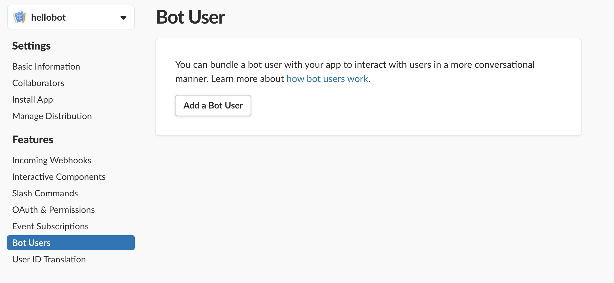
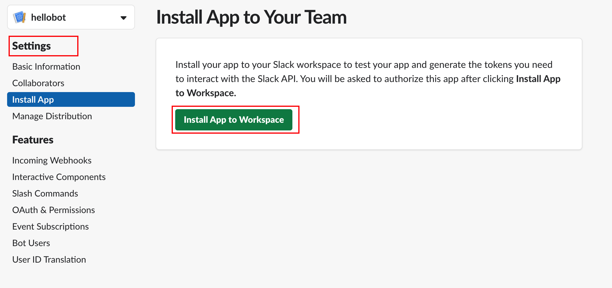
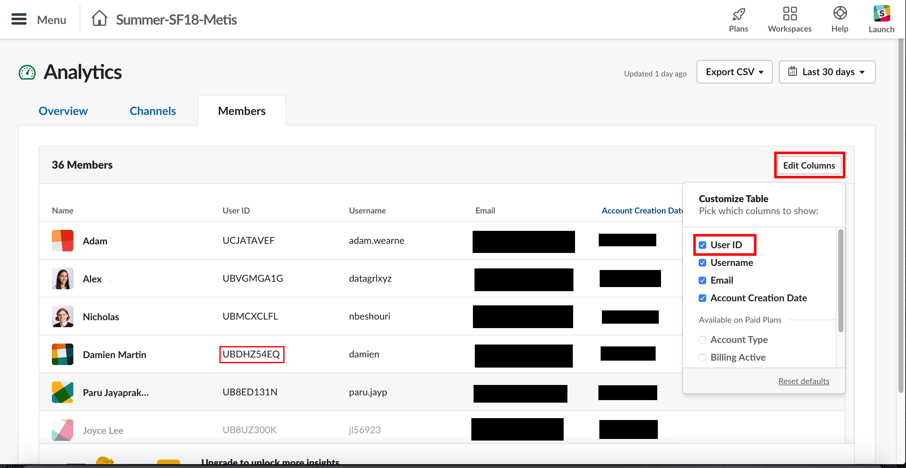
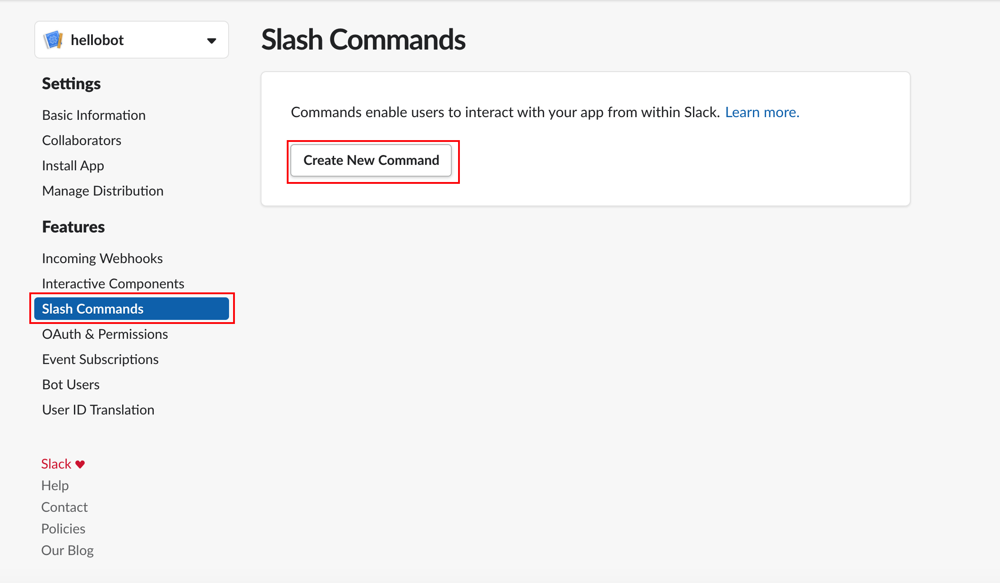
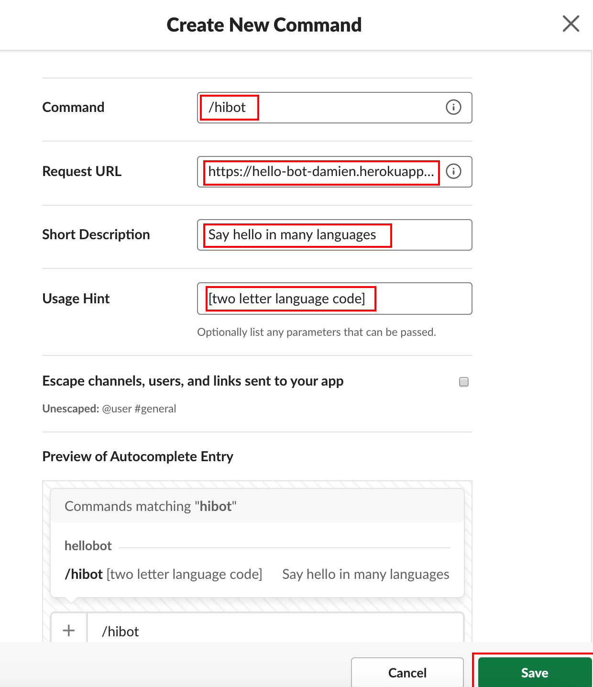

# Making a Slackbot in Python

We will be making a slackbot called `HelloBot`, which will implement one command `/hibot [language]`, where `[language]` is a two-letter code for the language of choice. If not language is given, it will default to English.

The name of the bot is controlled in the `.env` file.

We need to setup in two places:
* Slack
* Heroku

## Setup on Slack
1. Clone this repo
2. Go to https://api.slack.com/apps/new to create a new app. Fill in the app name with the name of your bot, and the `Development Slack Workspace` as the name of the workspace you want to use your bot in.
3. Select *Bot Users* and "Add a Bot User"
  
  We will be calling our bot user `HelloBot`.
4. Now click `Install App` from the left menu (under Settings), then click `Install App to Workspace`
  

  You will be asked to authorize your bot. Do it!
5.  Copy the slack token and OAuth into your `.env` file:
```bash
FLASK_APP=hellobot.py
APP_ENV=production    # must be production!
SLACK_CHANNEL=......  # id of the channel the bot posts in; e.g. #bot_test (no quotes)
OAuth=xoxp-........   # your OAuth will start with xoxp-
SLACK_TOKEN=xoxb-...  # your SLACK_TOKEN will start with xoxb-
BOTNAME=HelloBot      # name of the bot
```
  Don't include the comment hashes (this will be important when deploying to Heroku)


Don't close this dashboard for your bot yet. Once we have deployed the app, we will add our "Slash command" (in this case, `/hibot`).

### Testing
Once you have done all of this, you can use python to test your configuration. You will need to find your user id. Go to https://summer-sf18-metis.slack.com/stats#members and click "Edit Columns". Select "User id" and copy-and-paste your user id:
  

* Run the app in one terminal window:
```python
python hellobot.py
```
* In a separate terminal, load python and run the following script:
```python
python test/send_test_message.py <USERID>
```
where <USERID> is your user id found above. It is a string like `UBDHZ54EQ`, NOT your display name!

If the test is successful, you should receive a message from HelloBot saying "Hello <your display name>"

## Setup Heroku
1. Install heroku: `brew install heroku/brew/heroku`
2. Create a heroku app with `heroku create <appname>`. Replace <appname> with an application name of your choice. Note that this name cannot be used by any other app. I will call my `hello-bot-damien`, but you will need another name for yours.
3. Setup Heroku environment variables with `./setup_env.sh`
4. Run `git push heroku master`. You should get a message that ends with
```bash
remote:        https://<appname>.herokuapp.com/ deployed to Heroku
remote:
remote: Verifying deploy... done.
To https://git.heroku.com/<appname>.git
 * [new branch]      master -> master
```
  where <appname> is the name you have chosen above.

5. Go back to the slack page for your bot, and click on `Slash Commands`, under `Features`. Click on `Create New Command`.
  
6. Fill out the create new command dialog with the following parameters:


  | Field | Value |
  | --- | --- |
  | Command | /hibot |
  | Request URL | https://<appname>.herokuapp.com/hibot |
  | Short description | Say hello in many languages |
  | Usage Hint | [two letter language code] |

  Then click save.

  
7. You may need to reauthorize your app. If so, do it.

You should now be able to call `/hibot en` and have it reply to you!

## Going further / customizing

A lot of the code is boilerplate. If you want to add new "slash" commands, then you will need to
* Go to `app/actions.py` and add a new action that you want to call. Note that you can have the same `/command` map to multiple actions (notice how if you run `/hibot help` as a command, you will get a list of languages)
* Go to `app/__init__.py` and add a new POST request for your new command. This post request should call the action you created. You can use the commands to set the new actions.
* Go to the Slack admin page for your bot, and add a new Slash command. You need to make sure that the new slash command has a request URL of `https://<appname>.herokuapp.com/<post url>`, where `/<post url>` matches the POST request you just made in `app/__init__.py`

Once you have done all that, just run
```bash
git add .
git commit -m "Your message"
git push heroku master
```
and your app should be deployed!
